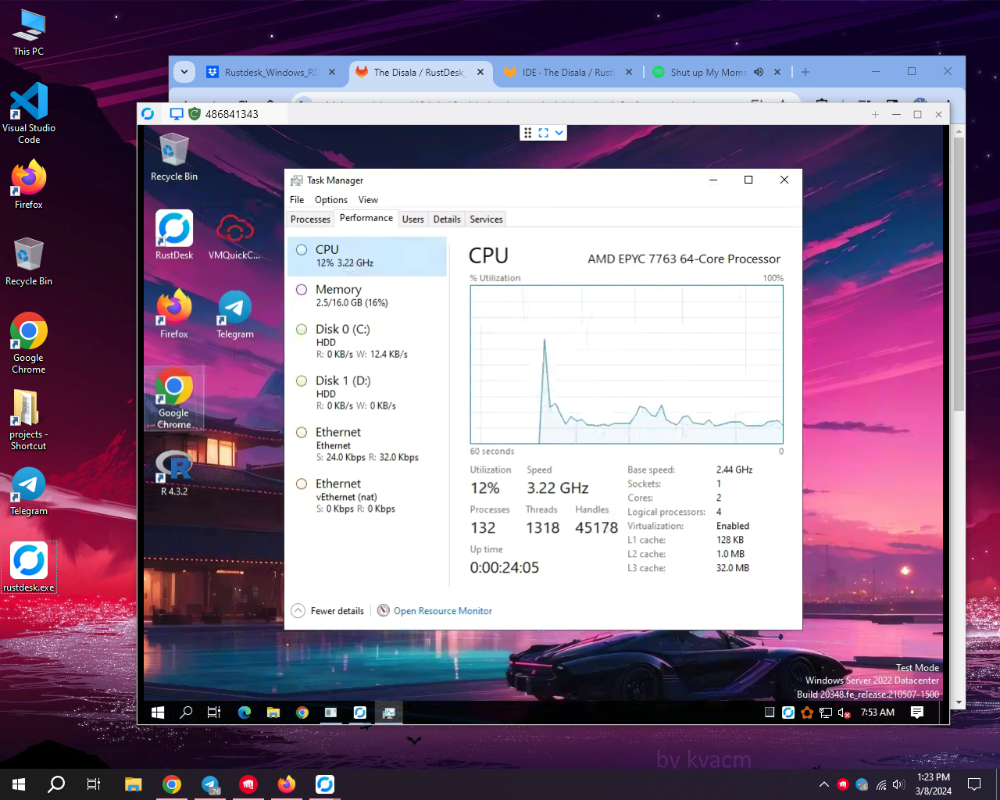

## Windows 10 Github RDP ft RustDesk

# Read This Before Rushing To Actions Tab In Github 💀

* i'm **not responsible** for **suspended github accounts**
* **Don't try these in your personal github account** or don't make emails same as your personal github email to make fake github account.
---
### Windows 10 Least

VM features:
* AMD EPYC 7763 64-Core Processor 2.44 GHz (**2 cores**)
* 16 GB RAM
* 150+255 GB Disk
* We Have Some Cool Features That Other workflows Dosen't Have
  - Automatically Telegram Installed
  - Automatically Winrar Installed
  - Automatically VM Quick Config Installed
  - Removed Stupid/Unrated Softwares
  - Added New Wallpaper
  - Ect ...

## Deploy and Run

    
Windows 10 RDP Install and Run

 
    
* Just **Download The Workflow** from **Release**.

* **Open Workflow** in **NotePad and Copy All** (**Ctrl+A & Ctrl+C**).
    
* **Create new Repo in Github.**

* Go to **Actions** Tab , Click **set up a workflow yourself**.

* **Paste (Ctrl+V) that copied workflow code** & click **Commit changes**...
    
* Now go to **Actions** Tab and **select workflow**.

* Click **Run Workflow** button on the left of **This workflow has a workflow_dispatch event trigger** line.

* Click the **Run** and Click **Start Building** & **Wait few minutes**.

* **Download & Install RustDesk Application** On Your Device **([Android/Windows/Linux/Macos](https://github.com/rustdesk/rustdesk/releases))**

* **Copy the RustDesk ID & Paste** it in your RustDesk **Enter Remote ID** Place & **Hit Enter** .

* **Copy RustDesk Password from The Run** & **Paste it** & **Hit Enter**.

* **Enjoy!**

# [Watch Tutorial If You Dosen't Understand This.](https://youtu.be/u3hHCQPACmY?si=3zFXwHd5snYIScov)

### Brought To You By Disala 💀 , Its Functional 😗.
### You Can See ID , Username , Pass , Pc Name And Cool Ascki Art 